<div align="center">

# MachiMirai (まちミライ)
### Japan Municipal Survival Intelligence Platform for Depopulating Towns
#### 自治体存続インテリジェンス・プラットフォーム

[](https://fastapi.tiangolo.com)
[](https://www.python.org)
[](https://react.dev)
[](https://www.typescriptlang.org)
[](https://vitejs.dev)
[](https://www.sqlalchemy.org)
[](https://pytest.org)
[](LICENSE)

<p align="center">
  <b>A mission-critical GovTech decision-support and demographic forecasting platform engineered for Japan's 477+ depopulating municipalities (市町村) and prefectural planning bureaus facing irreversible demographic contraction.</b>
</p>

[Key Features](#-core-capabilities) • [System Architecture](#-system-architecture) • [Mathematical Models](#-demographic-forecasting-engine) • [API Reference](#-api-reference) • [Getting Started](#-quickstart-guide) • [Pre-seeded Municipalities](#-pre-seeded-municipalities)

---

</div>

## 📌 Executive Summary & Problem Context

Japan is confronting the most acute demographic collapse in modern industrial history. By January 2026, the national population dropped below **119.74 million** (the first time under 120M in 42 years), with annual births hitting an all-time nadir of **~705,000** against more than **1.58 million** annual deaths. Over **30%** of Japan's population is 65 or older, and more than **477 municipalities** (one in four) have suffered population declines exceeding 10% in just five years.

```
┌────────────────────────────────────────────────────────────────────────────────────────┐
│                                 THE MUNICIPAL CRISIS                                   │
├─────────────────────────┬───────────────────────────────┬──────────────────────────────┤
│ 🏫 Infrastructure Decay │ 40-50% surplus capacity       │ Elementary schools with 3    │
│                         │ across public assets          │ students; unmaintainable     │
│                         │                               │ water treatment plants       │
├─────────────────────────┼───────────────────────────────┼──────────────────────────────┤
│ 📉 Fiscal Insolvency    │ Local tax base shrinking 2-4% │ Fixed maintenance costs      │
│                         │ annually; welfare costs surge │ trigger sudden municipal     │
│                         │                               │ "fiscal cliffs" (財政破綻)   │
├─────────────────────────┼───────────────────────────────┼──────────────────────────────┤
│ 🏚️ Abandoned Properties │ 9,000,000+ empty homes        │ Structural collapse, wildfire│
│                         │ (空き家 - Akiya) nationwide   │ vectors, crime hotspots      │
├─────────────────────────┼───────────────────────────────┼──────────────────────────────┤
│ 👵 Isolated Elderly     │ 6.8M+ seniors living alone    │ 24+ hour undetected crisis,  │
│                         │ in rural valleys              │ solitary deaths (孤独死)     │
└─────────────────────────┴───────────────────────────────┴──────────────────────────────┘
```

**MachiMirai (まちミライ)** bridges the gap between political paralysis and actionable civic strategy. Aligned with Japan's **Digital Garden City Nation Initiative (デジタル田園都市国家構想)**, **Society 5.0**, and **Regional Revitalization 2.0 (地方創生2.0)**, MachiMirai equips local mayors, prefectural governors, and welfare officers with algorithmic intelligence to execute **evidence-based smart shrinkage (スマート・シュリンク)**.

---

## 🏛️ System Architecture

MachiMirai is engineered with a decoupled, high-performance architecture: a **FastAPI** asynchronous microservice layer driving numerical demographic simulations in **NumPy**, coupled with a **React 19 + TypeScript + Vite** client styled with an obsidian enterprise GovTech theme, interactive **Leaflet GIS maps**, and **Recharts** reactive analytics.

```mermaid
graph TB
    subgraph Client ["Frontend Presentation Layer (React 19 + TypeScript + Vite)"]
        UI_Nav["Persona Switcher (Mayor / Planner / Welfare / Citizen) & Bilingual i18n (JA/EN)"]
        UI_Demo["Demographic Intelligence (Pyramid, Single-Year Cohorts, Countdown Solver)"]
        UI_Shrink["Smart Shrinkage Planner (GIS Facility Inventory, What-If Simulator)"]
        UI_Fisc["Fiscal Monitor (20-Yr Revenue/Expenditure, Bankruptcy Cliff Warning)"]
        UI_Akiya["Akiya Manager (Hazard Scoring, AI Repurposing, Demolition Priority)"]
        UI_Eld["Elderly Welfare Network (Telemetry Anomaly Radar, Smart Meter Sparks)"]
        UI_Mig["Migration Attraction Toolkit (7-Pillar Attractiveness, Subsidy ROI Calculator)"]
    end

    subgraph API ["GovTech API Gateway (FastAPI / Asynchronous Router Mesh)"]
        R_Auth["/api/auth (RBAC / JWT Security)"]
        R_Muni["/api/municipalities"]
        R_Demo["/api/demographics"]
        R_Shrink["/api/shrinkage"]
        R_Fisc["/api/fiscal"]
        R_Akiya["/api/akiya"]
        R_Eld["/api/elderly"]
        R_Mig["/api/migration"]
    end

    subgraph Engine ["Mathematical Simulation & Analytics Engines"]
        CC_Engine["NIPSSR Cohort-Component Engine (101 Single-Year Cohorts, MHLW Life Tables)"]
        GIS_Engine["Geospatial Shrinkage & Facility Coverage Analyzer (30-min Travel Matrix)"]
        Fiscal_Engine["Local Tax Yield & Social Transfer Invariance Model"]
        Hazard_Engine["Akiya Multi-Hazard Matrix (Structural, Wildfire, Environmental)"]
        IoT_Engine["24-Hour Telemetry & Smart Meter Anomaly Detector"]
        ROI_Engine["Municipal Revitalization Incentive Yield Solver"]
    end

    subgraph Storage ["Persistent Operational Data Store"]
        DB[(SQLite / PostgreSQL via SQLAlchemy 2.0 ORM)]
        SeedData[("Curated Municipal Seed (Minamiaso, Gojome, Kamiyama, Yubari)")]
    end

    Client <-->|REST / JSON / Bearer JWT| API
    API --> Engine
    Engine <--> Storage
    Storage --- SeedData
```



---

## 🌟 Core Capabilities

### 1. Demographic Intelligence Dashboard (P0)
- **NIPSSR Cohort-Component Model**: Projects population across 101 single-year age cohorts ($0$ to $100+$) using MHLW Complete Life Tables, Age-Specific Fertility Rates (ASFR), and age-dependent rural net migration curves.
- **Dynamic Age-Sex Pyramid**: Direct visual comparison of 2026 baseline distributions against 2036, 2046, and 2056 forecasts with elderly/child ratio markers.
- **Municipal Countdown Solver**: Calculates the exact calendar year when total population breaches critical municipal viability thresholds ($10{,}000$, $7{,}500$, $5{,}000$, $3{,}000$, $1{,}000$ residents).
- **Sub-Municipal (町丁・字) Breakdown**: Granular micro-district telemetry tracking vital rates, depopulation velocity, and youth drain.

### 2. Smart Shrinkage Planner (P0)
- **GIS Public Facility Inventory**: Comprehensive tracking of elementary schools, secondary schools, general hospitals, rural clinics, community centers, water treatment plants, and bridges with structural age and annual maintenance costs.
- **Consolidation What-If Scenario Simulator**: Quantifies annual budget savings ($\yen$), changes in average student commute time, and healthcare coverage ratios.
- **Compact City Zonation**: Visualizes neighborhoods classified into *Maintain Core Services (維持)*, *Gradual Consolidation (統合)*, and *Retire & Rewild (集約・撤退)*.
- **30-Minute Emergency Medical Envelope**: Real-time validation that at least 95% of remaining rural citizens retain emergency medical access within 30 minutes.

### 3. Fiscal Sustainability Monitor (P1)
- **20-Year Balance Sheet Forecast**: Dual-stream projection of tax revenue collapse (resident tax, property tax, corporate inhabitant tax) vs. soaring social security and infrastructure upkeep.
- **Fiscal Cliff Early Warning**: Identifies the exact projected year of municipal insolvency (*Financial Rehabilitation Designation* / 財政再生団体) up to 10 years in advance.
- **Grant Dependency Index**: Tracks municipal reliance on National Treasury Allocations (*地方交付税交付金*) and ranks fiscal independence ratios (財政力指数) against regional cohorts.

### 4. Akiya (Empty House) Manager (P1)
- **Geospatial Hazard Mapping**: Catalog of vacant and abandoned homes evaluated under the Revised Akiya Special Measures Act (改正空家等対策特別措置法).
- **Composite Risk Scoring Engine**: Algorithmic scoring combining structural collapse danger, wildfire hazard, and pest infestation vectors ($0-100$).
- **AI-Guided Repurposing Engine**: Contextual recommendations for property revitalization: *Telework Satellite Office*, *Community Daycare/Cafe*, *Licensed Minpaku (民泊)*, or *Mandatory Municipal Demolition (代執行)*.
- **Demolition Priority Matrix**: Optimizes annual municipal demolition budgets against public safety risk and neighborhood revitalization impact.

### 5. Elderly Welfare Network (P1)
- **Isolated Senior Registry**: Detailed surveillance tracking vulnerable single-occupant elderly residents ($\ge 75$ years), mobility grades (A/B/C), chronic medical conditions, and emergency contacts.
- **24-Hour IoT Inactivity Anomaly Radar**: Real-time monitoring of passive telemetry (smart water meters, electrical load sensors, infrared motion beacons) to prevent *kodokushi* (孤独死 - solitary death).
- **Community Check-In Logger**: In-person log system for welfare commissioners (民生委員), post office couriers, and volunteer patrols.

### 6. Migration Attraction Toolkit (P2)
- **7-Pillar Attractiveness Radar**: Systematic benchmarking across *Natural Environment*, *Affordable Housing*, *Childcare Subsidies*, *Digital Infrastructure (Fiber/5G)*, *Healthcare Access*, *Local Employment*, and *Public Transit*.
- **Revitalization Investment ROI Simulator**: Computes net present return on public incentive funds (e.g. $\yen 50\text{M}$ invested in young family relocation stipends $\rightarrow$ projected children enrolled $\rightarrow$ 10-year municipal tax yield).
- **National Success Case Repository**: Documented strategic case studies from trailblazing towns (Kamiyama Tokushima fiber hub, Sabae Fukui open-data eyewear cluster, Ama-cho Shimane educational revival).

### 7. Multi-Persona Governance & Full Bilingual Localization
- **Instant Persona Switcher**: Tailors operational interfaces for four distinct civil stakeholders:
  - 🏛️ **Mayor Tanaka (南阿蘇村 村長)**: Executive summary, fiscal solvency, consolidation trade-offs.
  - 📊 **Officer Yamamoto (秋田県 企画官)**: Multi-town benchmarking, macro indicators, prefectural grants.
  - 🩺 **Coordinator Suzuki (福祉課・民生委員)**: Micro-level elderly check-ins, sensor alerts, home visits.
  - 🏡 **Citizen Satō (地域住民・起業家)**: Akiya acquisition, town attractiveness, civic transparency.
- **Bilingual Interface**: Native Japanese (日本語) and professional English with instant, lossless toggle across all dashboard views.

---

## 🧮 Demographic Forecasting Engine

MachiMirai implements the standard demographic methodology established by the **National Institute of Population and Social Security Research (NIPSSR / 国立社会保障・人口問題研究所)**:

$$\begin{aligned}
P_{a+1, t+1}^{(s)} &= P_{a, t}^{(s)} \cdot S_{a}^{(s)} + M_{a}^{(s)} \\
P_{0, t+1}^{(f)} &= \frac{100}{205.5} \sum_{a=15}^{49} P_{a, t}^{(f)} \cdot f_{a} \\
P_{0, t+1}^{(m)} &= \frac{105.5}{205.5} \sum_{a=15}^{49} P_{a, t}^{(f)} \cdot f_{a}
\end{aligned}$$

Where:
- $P_{a, t}^{(s)}$ represents population of sex $s \in \{m, f\}$ at exact age $a \in [0, 100]$ in calendar year $t$.
- $S_{a}^{(s)}$ represents the cohort survival probability derived from the MHLW 23rd Complete Life Table.
- $f_{a}$ is the Age-Specific Fertility Rate scaled to the municipality's Total Fertility Rate (TFR).
- $M_{a}^{(s)}$ is the age-stratified net migration vector capturing the rural youth out-migration spike (ages 18–24).
- Age $100+$ functions as an open-ended terminal accumulator.

### Core Implementation Snippet (`backend/app/demographic_engine.py`)

```python
def run_cohort_component_projection(
    male_pop: np.ndarray,
    female_pop: np.ndarray,
    tfr: float = 1.2,
    years_ahead: int = 30,
    scenario: str = "baseline",
    base_year: int = 2026
) -> List[Dict[str, Any]]:
    survival_rates = get_standard_survival_rates()
    fertility_rates = get_fertility_curve(tfr)
    migration_rates = get_rural_migration_curve(scenario=scenario)
    
    male = male_pop.copy()
    female = female_pop.copy()
    results = []

    for y in range(1, years_ahead + 1):
        new_male = np.zeros(101)
        new_female = np.zeros(101)
        
        # 1. Single-year cohort aging with survival probabilities
        for a in range(1, 100):
            new_male[a] = male[a - 1] * survival_rates[a - 1]
            new_female[a] = female[a - 1] * survival_rates[a - 1]
            
        # Top-coded 100+ accumulator
        new_male[100] = (male[99] * survival_rates[99]) + (male[100] * survival_rates[100])
        new_female[100] = (female[99] * survival_rates[99]) + (female[100] * survival_rates[100])
        
        # 2. Births with historical Japan sex ratio (105.5 males : 100 females)
        total_births = np.sum(female[15:50] * fertility_rates)
        new_male[0] = total_births * (105.5 / 205.5)
        new_female[0] = total_births * (100.0 / 205.5)
        
        # 3. Age-specific rural net migration
        for a in range(101):
            new_male[a] = max(0.0, new_male[a] + (new_male[a] * migration_rates[min(a, 99)]))
            new_female[a] = max(0.0, new_female[a] + (new_female[a] * migration_rates[min(a, 99)]))
            
        male, female = new_male, new_female
        # Record annual cohort metrics, elderly ratios, and countdown states...
```

---

## 🗺️ Pre-Seeded Municipalities

MachiMirai comes out-of-the-box with authentic datasets for four representative Japanese municipalities spanning varied geographic typologies:

| Municipality | Prefecture | Type | Current Pop (2026) | Peak Pop (Year) | Elderly Ratio | Fiscal Index | Primary Challenge |
|:---|:---|:---:|:---:|:---:|:---:|:---:|:---|
| **南阿蘇村 (Minamiaso)** | 熊本県 (Kumamoto) | 村 (Village) | 9,247 | 18,500 (1980) | 38.2% | 0.32 | School consolidation & hospital survival |
| **五城目町 (Gojome)** | 秋田県 (Akita) | 町 (Town) | 8,110 | 18,900 (1975) | 43.1% | 0.28 | Steepest elderly ratio & severe akiya count |
| **神山町 (Kamiyama)** | 徳島県 (Tokushima) | 町 (Town) | 4,680 | 21,000 (1955) | 51.5% | 0.31 | Satellite office hub & digital nomad strategy |
| **夕張市 (Yubari)** | 北海道 (Hokkaido) | 市 (City) | 6,320 | 116,908 (1960) | 54.2% | 0.18 | Post-coal bankruptcy & extreme compact city |

---

## 💻 Tech Stack & Infrastructure

```
┌────────────────────────────────────────────────────────────────────────────┐
│ FRONTEND                                                                   │
│ • React 19.2 (Hooks, Context, StrictMode)                                  │
│ • TypeScript 5.8 (Strict null checks, typed interfaces)                    │
│ • Vite 8.3 (Hot Module Replacement, lightning production bundling)         │
│ • Leaflet 1.9 + React-Leaflet (Interactive GIS infrastructure maps)        │
│ • Recharts 3.10 (Responsive SVG pyramids, area forecasts, radar charts)    │
│ • Lucide-React (High-density GovTech UI icons)                             │
│ • Custom Dark Obsidian Design System (Vanilla CSS with CSS custom tokens)  │
├────────────────────────────────────────────────────────────────────────────┤
│ BACKEND                                                                    │
│ • Python 3.11+ / FastAPI 0.115 (Asynchronous ASGI endpoints)               │
│ • SQLAlchemy 2.0 (Relational ORM & SQLite / PostgreSQL dialect)            │
│ • NumPy 1.26 + Pandas 2.0 (Vectorized demographic cohort projection)       │
│ • Pydantic 2.0 (Strict data validation and schema serialization)           │
│ • Uvicorn (Lightning-fast ASGI production server)                          │
│ • Pytest 8.0 (Comprehensive backend test harness)                          │
└────────────────────────────────────────────────────────────────────────────┘
```

---

## ⚡ Quickstart Guide

### Prerequisites
- **Node.js**: `v18.0.0` or higher ([Download Node.js](https://nodejs.org/))
- **Python**: `v3.10` or higher ([Download Python](https://www.python.org/))
- **Git**: `v2.30` or higher

### 1. Clone & Setup Workspace
```bash
git clone https://github.com/CharanTeja-16/MachiMirai.git
cd MachiMirai
```

### 2. Backend Setup & Startup
Open a terminal in the root directory:

```powershell
# Navigate to backend directory
cd backend

# Create and activate a virtual environment (optional but recommended)
python -m venv venv
.\venv\Scripts\Activate.ps1    # Windows
# source venv/bin/activate     # Linux / macOS

# Install dependencies
pip install -r requirements.txt

# Start the FastAPI ASGI server (auto-creates and seeds SQLite database)
python -m uvicorn app.main:app --reload --port 8000
```
- 🌐 **API Base**: `http://localhost:8000/`
- 📑 **Interactive Swagger Docs**: `http://localhost:8000/docs`
- 📖 **ReDoc Alternative Docs**: `http://localhost:8000/redoc`

### 3. Frontend Setup & Startup
In a separate terminal window:

```powershell
# Navigate to frontend directory
cd frontend

# Install dependencies
npm install

# Launch Vite development server
npm run dev
```
- 💻 **Application URL**: `http://localhost:5173/`

### 4. Running Verification & Test Suites
```powershell
# Run backend pytest suite (11 unit & integration tests)
cd backend
python -m pytest tests -v

# Run frontend TypeScript typecheck & production build
cd frontend
npm run build
```

---

## 📡 API Reference

All endpoints are prefixed with `/api` and return standardized JSON payloads.

<details>
<summary><b>Click to expand full REST Endpoint Matrix</b></summary>

### 1. Municipalities & Health
| Method | Endpoint | Description |
|:---|:---|:---|
| `GET` | `/api/health` | Service health status and database connectivity check |
| `GET` | `/api/municipalities` | List all tracked municipalities with high-level demographic aggregates |
| `GET` | `/api/municipalities/{id}` | Detailed municipality profile including peak population, area, and survival score |

### 2. Demographic Intelligence
| Method | Endpoint | Description |
|:---|:---|:---|
| `GET` | `/api/demographics/dashboard/{muni_id}` | Complete demographic package: 30-yr projection, pyramid, countdown, cohorts |
| `POST` | `/api/demographics/simulate` | Custom what-if demographic projection with variable TFR and migration rates |
| `GET` | `/api/demographics/neighborhoods/{muni_id}`| Micro-district (町丁) population breakdown and depopulation risk tags |
| `GET` | `/api/demographics/benchmarks` | Comparison against prefecture and national depopulation benchmarks |

### 3. Smart Shrinkage & Facilities
| Method | Endpoint | Description |
|:---|:---|:---|
| `GET` | `/api/shrinkage/facilities/{muni_id}` | Complete public infrastructure GIS inventory with maintenance costs |
| `POST` | `/api/shrinkage/simulate` | Facility consolidation simulator modeling $\yen$ savings and commute changes |
| `GET` | `/api/shrinkage/scenarios/{muni_id}` | Retrieve pre-calculated municipal consolidation scenarios |

### 4. Fiscal Sustainability
| Method | Endpoint | Description |
|:---|:---|:---|
| `GET` | `/api/fiscal/forecast/{muni_id}` | 20-year revenue vs expenditure trajectory and insolvency cliff forecast |

### 5. Akiya (Empty House) Management
| Method | Endpoint | Description |
|:---|:---|:---|
| `GET` | `/api/akiya/{muni_id}` | GIS list of vacant properties with multi-hazard risk scoring |
| `POST` | `/api/akiya/prioritize` | Budget-optimized demolition and repurposing decision solver |

### 6. Elderly Welfare Network
| Method | Endpoint | Description |
|:---|:---|:---|
| `GET` | `/api/elderly/{muni_id}` | Registry of monitored single-occupant elderly citizens |
| `GET` | `/api/elderly/alerts/{muni_id}` | Active 24-hour inactivity emergency alerts (*kodokushi* prevention) |
| `POST` | `/api/elderly/checkin/{resident_id}` | Log physical or telephone check-in by welfare commissioner |

### 7. Migration Attraction
| Method | Endpoint | Description |
|:---|:---|:---|
| `GET` | `/api/migration/scorecard/{muni_id}` | 7-pillar municipality attractiveness radar scores |
| `POST` | `/api/migration/simulate-roi` | Revitalization incentive ROI solver (inflow vs tax revenue yield) |
| `GET` | `/api/migration/case-studies` | Curated national best-practice case studies (Kamiyama, Sabae, Ama-cho) |

### 8. Authentication & RBAC
| Method | Endpoint | Description |
|:---|:---|:---|
| `POST` | `/api/auth/login` | OAuth2 / JSON login returning JWT Bearer token |
| `GET` | `/api/auth/me` | Current authenticated user profile and persona role |

</details>

---

## 📂 Repository Structure

```text
MachiMirai/
├── backend/                             # Python FastAPI Backend Service
│   ├── app/
│   │   ├── __init__.py
│   │   ├── database.py                  # SQLAlchemy engine & session factory
│   │   ├── demographic_engine.py        # NIPSSR single-year cohort projection model
│   │   ├── main.py                      # FastAPI initialization, lifespan & CORS
│   │   ├── models.py                    # Relational ORM models
│   │   ├── schemas.py                   # Pydantic validation schemas
│   │   ├── seed.py                      # Municipal database seeder
│   │   └── routers/                     # Modular REST API endpoints
│   │       ├── akiya.py                 # Vacant house hazard scoring & reuse
│   │       ├── auth.py                  # JWT authentication & persona RBAC
│   │       ├── demographics.py          # Cohort projection & countdown solvers
│   │       ├── elderly.py               # IoT telemetry & welfare monitoring
│   │       ├── fiscal.py                # Revenue/expenditure & insolvency warning
│   │       ├── migration.py             # Attractiveness radar & subsidy ROI
│   │       ├── municipalities.py        # Municipal profile queries
│   │       └── shrinkage.py             # Facility inventory & consolidation
│   ├── tests/                           # Pytest verification suite
│   │   ├── test_api.py                  # API endpoint integration tests
│   │   └── test_demographics.py         # Cohort-component mathematical tests
│   ├── machimirai.db                    # SQLite database store
│   └── requirements.txt                 # Backend Python package manifest
│
├── frontend/                            # React 19 + TypeScript + Vite Client
│   ├── public/                          # Static branding & vector assets
│   ├── src/
│   │   ├── components/                  # Domain-specific UI modules
│   │   │   ├── AkiyaManager.tsx         # Empty house GIS mapping & hazard prioritization
│   │   │   ├── DemographicDashboard.tsx # Population pyramids & cohort countdowns
│   │   │   ├── ElderlyNetwork.tsx       # 24hr anomaly telemetry & check-in log
│   │   │   ├── FiscalMonitor.tsx        # 20-year balance sheet & insolvency cliff
│   │   │   ├── MigrationToolkit.tsx     # 7-factor radar & subsidy ROI simulator
│   │   │   ├── Navbar.tsx               # Header with persona switcher & language toggle
│   │   │   ├── ShrinkagePlanner.tsx     # Facility consolidation scenario builder
│   │   │   └── Sidebar.tsx              # Application domain navigation
│   │   ├── api.ts                       # Typed REST client with error recovery
│   │   ├── i18n.ts                      # Bilingual (JA / EN) translation dictionary
│   │   ├── index.css                    # GovTech Obsidian design system
│   │   ├── App.tsx                      # Root component & state coordinator
│   │   └── main.tsx                     # React DOM entry point
│   ├── package.json                     # Frontend package manifest
│   ├── tsconfig.json                    # TypeScript compiler configuration
│   └── vite.config.ts                   # Vite build configuration
│
├── MachiMirai.md                        # Authoritative Project Specification Document
├── package.json                         # Root monorepo orchestration scripts
├── .gitignore                           # Git exclusions (caches, binaries, dist)
└── README.md                            # Comprehensive enterprise project documentation
```

---

## 🔒 Security, Compliance & Data Governance

MachiMirai is architected with strict adherence to Japanese government and municipal digital standards:
- **Act on the Protection of Personal Information (個人情報の保護に関する法律)**: Masking and pseudonymization of isolated elderly names and addresses in citizen and public planner views.
- **Role-Based Access Control (RBAC)**: Strict segregation between executive mayor privileges, welfare worker health records, and public citizen transparency tiers.
- **Open Data Standards Alignment**: Built for seamless integration with **e-Stat (政府統計の総合窓口)**, **RESAS (地域経済分析システム)**, and **Project PLATEAU (国土交通省 3D都市モデル)**.

---

## 🗺️ Product Roadmap

- [x] **v1.0.0 (Current Release)**: NIPSSR Cohort-Component Engine, GIS Shrinkage Simulator, Fiscal Insolvency Detector, Akiya Hazard Scoring, IoT Welfare Telemetry, Migration ROI Solver, Bilingual JA/EN.
- [ ] **v1.1.0 (Q3 2026)**: **Project PLATEAU (CityGML)** 3D Digital Twin visualization for compact city simulation.
- [ ] **v1.2.0 (Q4 2026)**: Multi-spectral satellite AI detection for unrecorded rural akiya roof collapse risk.
- [ ] **v2.0.0 (2027)**: Automated Ministry of Internal Affairs (総務省) Grant Application Form Generator for Regional Revitalization Subsidies.

---

## 📄 License

This project is distributed under the **MIT License**. See the [LICENSE](LICENSE) file for complete details.

---

<div align="center">
  <sub>Developed for Japan's regional revitalization and municipal preservation. Designed with ❤️ for depopulating communities across Japan.</sub><br>
  <sub>日本の持続可能な地域社会と自治体の存続のために。</sub>
</div>
