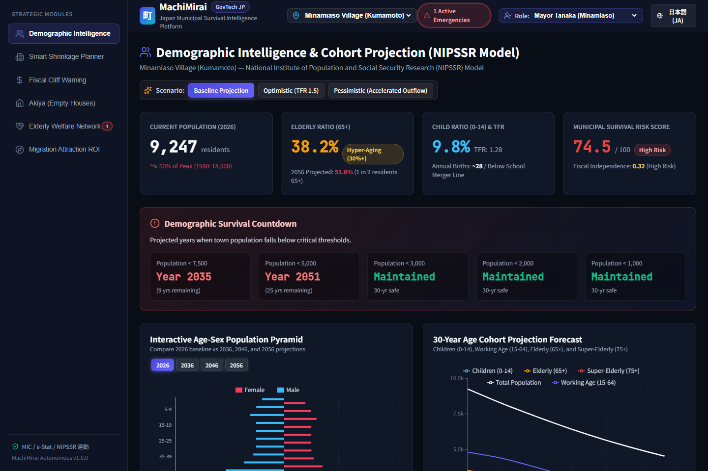
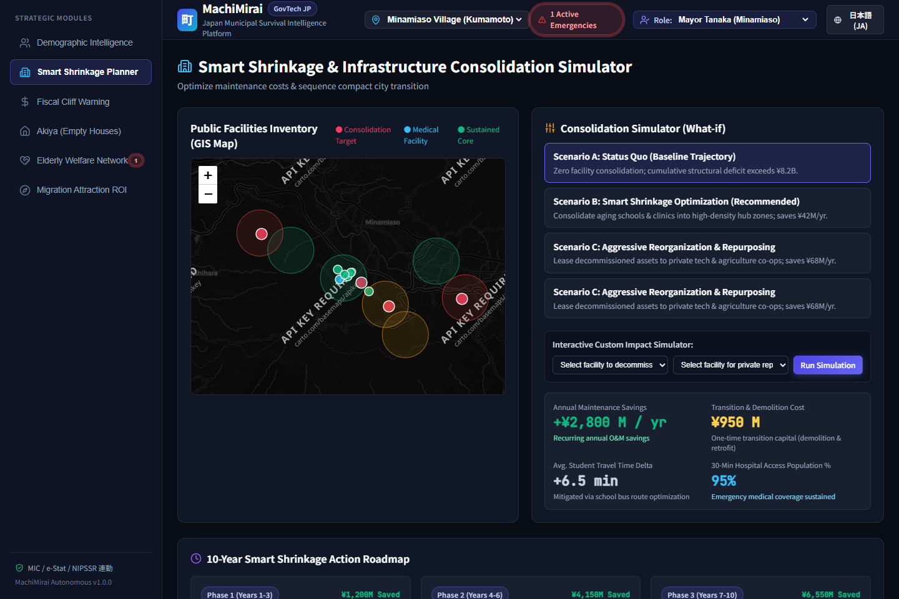
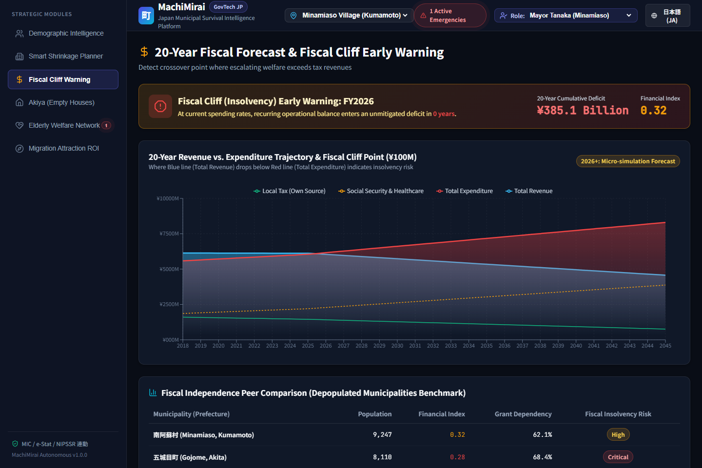
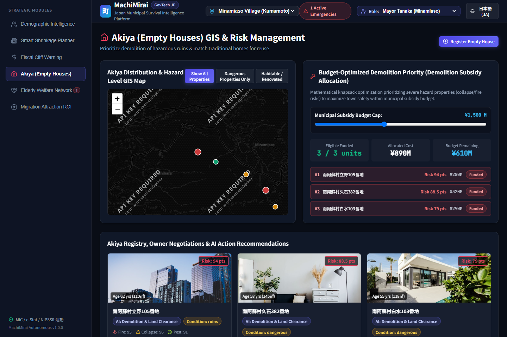
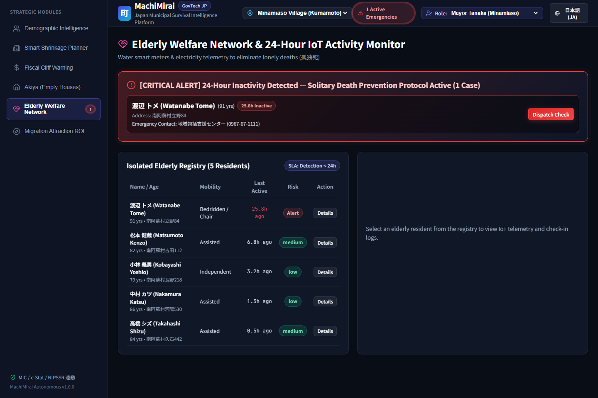
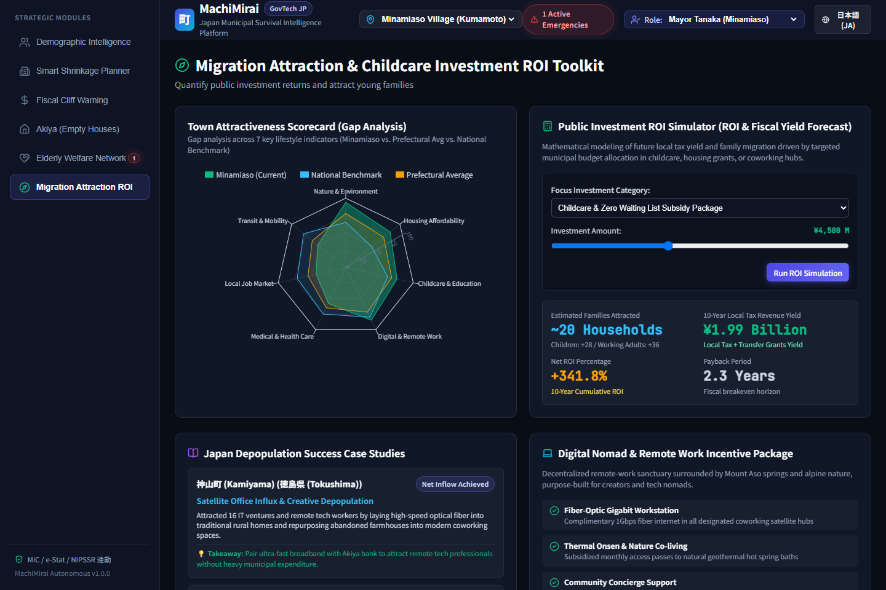
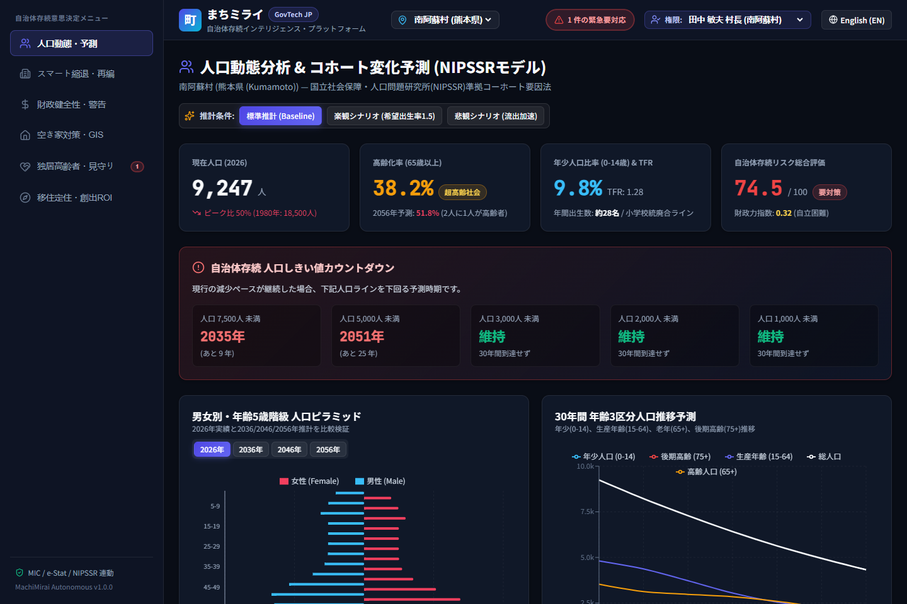
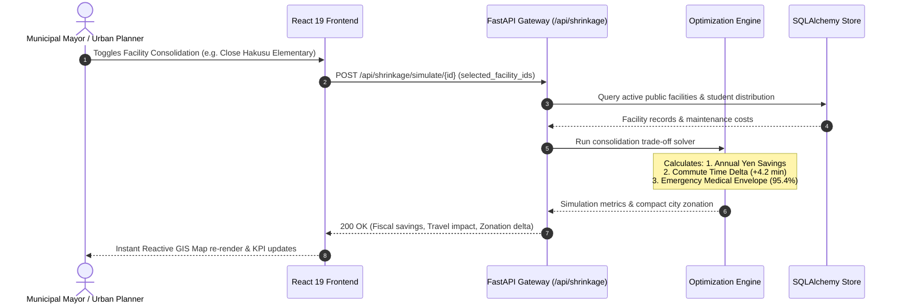

<div align="center">

# MachiMirai (まちミライ)
### Japan Municipal Survival Intelligence & Demographic Decision Platform
#### 自治体存続インテリジェンス・意思決定プラットフォーム

[](https://fastapi.tiangolo.com)
[](https://www.python.org)
[](https://react.dev)
[](https://www.typescriptlang.org)
[](https://vitejs.dev)
[](https://www.sqlalchemy.org)
[](https://pytest.org)
[](#-verification--testing)
[](#-security-privacy--rbac-governance)
[](LICENSE)

<br />

<p align="center">
  <b>A mission-critical GovTech decision-support and demographic forecasting platform engineered for Japan's 477+ depopulating municipalities (市町村) and prefectural planning bureaus facing irreversible demographic contraction.</b>
</p>

<p align="center">
  <i>Empowering mayors, urban planners, and welfare commissioners with algorithmic "smart shrinkage" (スマート・シュリンク), infrastructure consolidation modeling, fiscal cliff early warnings, akiya hazard mitigation, and IoT-driven isolated elderly safety networks.</i>
</p>

<br />



<br />

[Live Interface Showcase](#-live-application-showcase) • [Key Capabilities](#-core-capabilities) • [System Architecture](#-system-architecture) • [Mathematical Models](#-demographic-forecasting-engine) • [Code Highlights](#-code-highlights) • [Municipal Data](#-pre-seeded-municipalities) • [REST API](#-api-reference) • [Quickstart](#-quickstart-guide) • [Security & RBAC](#-security-privacy--rbac-governance)

---

</div>

## 📌 Executive Summary & Problem Landscape

### Japan's Existential Demographic Reality

Japan is experiencing the most acute demographic contraction in modern industrial history. By January 2026, the national population breached the psychological threshold below **119.74 million** (the first time under 120M in 42 years), with annual births dropping to a historic nadir of **~705,000** against more than **1.58 million** annual deaths. 

Over **30%** of Japan's population is 65 or older, and more than **477 municipalities** (one in four across the archipelago) have lost greater than 10% of their residents in just five years.

| Macro Demographic Metric | Official Value | Benchmark Agency / Source |
|:---|:---:|:---|
| **Total National Population (2026)** | **119.74 Million** | Ministry of Internal Affairs & Communications (総務省) |
| **Annual Registered Births** | **~705,809** | Ministry of Health, Labour and Welfare (厚生労働省) |
| **Annual Registered Deaths** | **~1,580,000+** | MHLW Vital Statistics (人口動態統計) |
| **Senior Population Ratio ($\ge 65$)** | **30.1%** | Cabinet Office Aging Society White Paper (高齢社会白書) |
| **Median National Age** | **50.2 Years** | United Nations Population Division |
| **Municipalities with >10% Loss (5yr)** | **477 Municipalities (25.1%)** | 2025 National Census (国勢調査) |
| **Projected Population by 2060** | **~87.0 Million (-31%)** | NIPSSR Projections (国立社会保障・人口問題研究所) |
| **Total Fertility Rate (TFR)** | **1.20** | Replacement threshold requires 2.07 |

```
┌────────────────────────────────────────────────────────────────────────────────────────┐
│                        UNMANAGED CONTRACTION vs. SMART SHRINKAGE                       │
├─────────────────────────────────────────┬──────────────────────────────────────────────┤
│ ❌ STATUS QUO: POLITICAL PARALYSIS       │ ✅ MACHIMIRAI: ALGORITHMIC SMART SHRINKAGE   │
├─────────────────────────────────────────┼──────────────────────────────────────────────┤
│ • Elementary schools with 3 students    │ • Data-backed facility consolidation roadmap │
│   cost ¥80M/yr to keep open             │   with travel time & budget tradeoff models  │
│ • Uncontrolled fiscal cliff crossover   │ • 10-year advance notice before reaching     │
│   (Financial Rehabilitation status)     │   Insolvency Designation (財政再生団体)       │
│ • 9,000,000+ abandoned homes (Akiya)   │ • Multi-hazard scoring (collapse, fire, pest)│
│   collapsing into road networks         │   and AI repurposing optimization            │
│ • Isolated elderly discovered days      │ • 24-hour smart meter & sensor telemetry     │
│   after solitary death (孤独死)          │   radar alerting local welfare commissioners │
└─────────────────────────────────────────┴──────────────────────────────────────────────┘
```

**MachiMirai (まちミライ)** directly addresses this operational void. Aligned with Japan's **Digital Garden City Nation Initiative (デジタル田園都市国家構想)**, **Society 5.0**, and **Regional Revitalization 2.0 (地方創生2.0)**, MachiMirai transforms disparate demographic, geospatial, fiscal, and welfare data silos into an actionable civic command center.

---

## 📸 Live Application Showcase

All images below are live screenshots captured directly from the running MachiMirai application runtime.

### 1. Demographic Intelligence & NIPSSR Cohort Model
> *Real-time cohort simulation across 101 single-year age cohorts, comparative 2026–2056 population pyramids, and municipal viability countdown timers.*


---

### 2. Smart Shrinkage & Facility Consolidation Simulator
> *Interactive Leaflet GIS mapping of public infrastructure with dynamic what-if budget consolidation modeling, travel time impact, and emergency medical envelope preservation.*



---

### 3. 20-Year Fiscal Forecast & Fiscal Cliff Warning
> *Dual-stream trajectory tracking revenue decline vs. surging social security expenditure, identifying the exact year of municipal insolvency.*



---

### 4. Akiya (Empty Houses) GIS & Hazard Management
> *Multi-hazard risk scoring (structural collapse, wildfire, pests) under the Revised Akiya Act paired with budget-optimized demolition prioritization.*



---

### 5. Elderly Welfare Network & 24-Hour IoT Radar
> *Monitored isolated senior registry with real-time smart meter anomaly detection to prevent solitary deaths (孤独死).*



---

### 6. Migration Attraction Toolkit & Subsidy ROI
> *7-pillar municipal attractiveness radar benchmarking and net present return solver for public relocation grants.*



---

### 7. Native Bilingual Japanese Interface (日本語対応)
> *Instant, lossless toggle between English and Japanese civic terminology across all operational views.*



---

## 🏛️ System Architecture

MachiMirai is architected with a decoupled microservice structure: an asynchronous **FastAPI** backend executing vectorized **NumPy** cohort simulations and geospatial distance computations, coupled with a **React 19 + TypeScript + Vite** client featuring an obsidian GovTech design system, **Leaflet GIS** maps, and reactive **Recharts** visualizations.

### 📐 High-Level Component Blueprint

```mermaid
graph TB
    subgraph Client ["Client Presentation Layer (React 19 + TypeScript + Vite)"]
        UI_Nav["Persona Switcher (Mayor / Planner / Welfare / Citizen) & Bilingual Toggle (JA/EN)"]
        UI_Demo["Demographic Intelligence (101-Cohort Pyramid, Countdown Solver, Micro-Districts)"]
        UI_Shrink["Smart Shrinkage Planner (Interactive GIS Map, What-If Consolidation Engine)"]
        UI_Fisc["Fiscal Monitor (20-Yr Balance Sheet, Insolvency Cliff Early Warning)"]
        UI_Akiya["Akiya Manager (Hazard Scoring, AI Repurposing, Demolition Priority Matrix)"]
        UI_Eld["Elderly Welfare Network (IoT Telemetry Radar, Smart Meter Sparks, Check-In Logger)"]
        UI_Mig["Migration Toolkit (7-Pillar Radar, Revitalization Subsidy ROI Simulator)"]
    end

    subgraph API ["GovTech API Gateway (FastAPI / Asynchronous Router Mesh)"]
        R_Auth["/api/auth (JWT Security & Persona RBAC)"]
        R_Muni["/api/municipalities"]
        R_Demo["/api/demographics"]
        R_Shrink["/api/shrinkage"]
        R_Fisc["/api/fiscal"]
        R_Akiya["/api/akiya"]
        R_Eld["/api/elderly"]
        R_Mig["/api/migration"]
    end

    subgraph Engines ["Mathematical Modeling & Analytics Engines"]
        CC_Engine["NIPSSR Cohort-Component Engine (101 Single-Year Cohorts, MHLW Life Tables)"]
        GIS_Engine["Geospatial Consolidation Engine (Haversine Matrix & 30-min Travel Envelopes)"]
        Fiscal_Engine["Local Tax Yield & Social Transfer Invariance Solver"]
        Hazard_Engine["Akiya Multi-Hazard Matrix (Structural, Wildfire, Environmental Risk)"]
        IoT_Engine["24-Hour Telemetry & Inactivity Anomaly Detector"]
        ROI_Engine["Municipal Revitalization Incentive Yield Simulator"]
    end

    subgraph Storage ["Persistent Operational Data Store"]
        DB[(SQLite / PostgreSQL via SQLAlchemy 2.0 ORM)]
        SeedData[("Curated Municipal Baseline: Minamiaso, Gojome, Kamiyama, Yubari")]
    end

    Client <-->|REST / JSON / Bearer JWT| API
    API --> Engines
    Engines <--> Storage
    Storage --- SeedData
```



### 🔄 Runtime Simulation Sequence Flow



---

## 🌟 Core Capabilities

### 1. 📊 Demographic Intelligence Dashboard
- **NIPSSR Cohort-Component Engine**: Simulates population dynamics across 101 single-year age cohorts ($0$ to $100+$) using MHLW Complete Life Tables, Age-Specific Fertility Rates (ASFR), and age-dependent rural net migration curves.
- **Dynamic Population Pyramid**: Interactive visualization comparing 2026 baseline distributions against 2036, 2046, and 2056 forecasts with elderly/working/child dependency ratios.
- **Municipal Survival Countdown**: Computes the exact calendar year when total population crosses critical municipal viability thresholds ($10{,}000$, $7{,}500$, $5{,}000$, $3{,}000$, $1{,}000$ residents).
- **Sub-Municipal (町丁・字) Breakdown**: Granular micro-district telemetry tracking vital rates, depopulation velocity, and youth outflow rates.

### 2. 🏗️ Smart Shrinkage Planner
- **GIS Public Facility Inventory**: Comprehensive tracking of elementary schools, junior high schools, rural hospitals, clinics, community centers, water treatment plants, and bridges with structural age, replacement value, and annual maintenance overhead.
- **What-If Scenario Simulator**: Quantifies annual municipal budget savings ($\yen$), changes in average student commute times, and healthcare coverage ratios when specific facilities are decommissioned or merged.
- **Compact City Zonation**: Categorizes neighborhoods into *Maintain Core Services (維持)*, *Gradual Consolidation (統合)*, and *Retire & Rewild (集約・撤退)*.
- **30-Minute Emergency Medical Envelope**: Geospatial boundary validation ensuring $\ge 95\%$ of remaining rural citizens retain emergency medical transport access within 30 minutes.

### 3. 📉 Fiscal Sustainability Monitor
- **20-Year Balance Sheet Forecast**: Dual-stream projection of tax revenue collapse (resident tax, fixed asset property tax, corporate inhabitant tax) vs. soaring social security and aged infrastructure maintenance.
- **Fiscal Cliff Early Warning**: Identifies the exact projected year of municipal insolvency (*Financial Rehabilitation Designation* / 財政再生団体) up to 10 years in advance.
- **Grant Dependency Index**: Tracks municipal reliance on National Treasury Allocations (*地方交付税交付金*) and ranks fiscal independence ratios (財政力指数) against national peer cohorts.

### 4. 🏚️ Akiya (Empty House) Manager
- **Geospatial Hazard Mapping**: Catalog of vacant and abandoned properties evaluated under Japan's **Revised Akiya Special Measures Act (改正空家等対策特別措置法)**.
- **Composite Risk Scoring Matrix**: Algorithmic scoring combining structural collapse danger, wildfire hazard, and pest infestation vectors ($0-100$).
- **AI-Guided Repurposing Engine**: Contextual recommendations: *Satellite Telework Office*, *Community Daycare / Cafe*, *Licensed Minpaku (民泊)*, or *Mandatory Municipal Demolition (代執行)*.
- **Demolition Priority Matrix**: Optimizes annual municipal demolition expenditure against public safety risk and neighborhood revitalization impact.

### 5. 🩺 Elderly Welfare Network
- **Isolated Senior Registry**: Directory tracking single-occupant elderly citizens ($\ge 75$ years), mobility grades (A/B/C), chronic medical conditions, and emergency contacts.
- **24-Hour IoT Inactivity Anomaly Radar**: Real-time monitoring of passive telemetry (smart water meter flow, electrical circuit load, infrared motion beacons) to prevent *kodokushi* (孤独死 - solitary death).
- **Community Check-In Logger**: Field logging interface for welfare commissioners (民生委員), post office couriers, and volunteer patrols.

### 6. 🚀 Migration Attraction Toolkit
- **7-Pillar Attractiveness Radar**: Systematic benchmarking across *Natural Environment*, *Affordable Housing*, *Childcare Subsidies*, *Digital Infrastructure (Fiber/5G)*, *Healthcare Access*, *Local Employment*, and *Public Transit*.
- **Revitalization Investment ROI Simulator**: Computes net return on public incentive funds (e.g. $\yen 50\text{M}$ young family relocation grant $\rightarrow$ projected children enrolled $\rightarrow$ 10-year municipal tax yield).
- **National Success Case Repository**: Documented strategic playbooks from trailblazing towns (Kamiyama Tokushima fiber hub, Sabae Fukui open-data cluster, Ama-cho Shimane educational revival).

### 7. 👥 Multi-Persona Governance & Full Bilingual Localization
- **Instant Persona Switcher**: Tailors operational interfaces for four distinct civil stakeholders:
  - 🏛️ **Mayor Tanaka (南阿蘇村 村長)**: Executive summary, fiscal solvency, consolidation trade-offs.
  - 📊 **Officer Yamamoto (秋田県 企画官)**: Multi-town benchmarking, macro indicators, prefectural grants.
  - 🩺 **Coordinator Suzuki (福祉課・民生委員)**: Micro-level elderly check-ins, sensor alerts, home visits.
  - 🏡 **Citizen Satō (地域住民・起業家)**: Akiya acquisition, town attractiveness, civic transparency.
- **Bilingual Interface**: Native Japanese (日本語) and professional English with instant, lossless toggle across all dashboard views.

---

## 🧮 Demographic Forecasting Engine

MachiMirai implements the standard demographic methodology established by the **National Institute of Population and Social Security Research (NIPSSR / 国立社会保障・人口問題研究所)**:

$$\begin{aligned}
P_{a+1, t+1}^{(s)} &= P_{a, t}^{(s)} \cdot S_{a}^{(s)} + M_{a}^{(s)} \\
P_{0, t+1}^{(f)} &= \frac{100.0}{205.5} \sum_{a=15}^{49} P_{a, t}^{(f)} \cdot f_{a} \\
P_{0, t+1}^{(m)} &= \frac{105.5}{205.5} \sum_{a=15}^{49} P_{a, t}^{(f)} \cdot f_{a}
\end{aligned}$$

Where:
- $P_{a, t}^{(s)}$ represents population of sex $s \in \{m, f\}$ at exact age $a \in [0, 100]$ in calendar year $t$.
- $S_{a}^{(s)}$ represents the cohort survival probability derived from the MHLW 23rd Complete Life Table.
- $f_{a}$ is the Age-Specific Fertility Rate scaled to the municipality's Total Fertility Rate (TFR).
- $M_{a}^{(s)}$ is the age-stratified net migration vector capturing the rural youth out-migration spike (ages 18–24).
- Age $100+$ functions as an open-ended terminal accumulator.

---

## 💻 Code Highlights

### Vectorized Demographic Cohort Engine (`backend/app/demographic_engine.py`)

```python
def run_cohort_component_projection(
    male_pop: np.ndarray,
    female_pop: np.ndarray,
    tfr: float = 1.2,
    years_ahead: int = 30,
    scenario: str = "baseline",
    base_year: int = 2026
) -> List[Dict[str, Any]]:
    """Vectorized NIPSSR Cohort-Component Projection Model (Ages 0 to 100+)."""
    survival_rates = get_standard_survival_rates()
    fertility_rates = get_fertility_curve(tfr)
    migration_rates = get_rural_migration_curve(scenario=scenario)
    
    male = male_pop.copy()
    female = female_pop.copy()
    results = []

    for y in range(1, years_ahead + 1):
        new_male = np.zeros(101)
        new_female = np.zeros(101)
        
        # 1. Single-year cohort aging with life-table survival probabilities
        for a in range(1, 100):
            new_male[a] = male[a - 1] * survival_rates[a - 1]
            new_female[a] = female[a - 1] * survival_rates[a - 1]
            
        # Top-coded 100+ accumulator
        new_male[100] = (male[99] * survival_rates[99]) + (male[100] * survival_rates[100])
        new_female[100] = (female[99] * survival_rates[99]) + (female[100] * survival_rates[100])
        
        # 2. Births with historical Japan sex ratio (105.5 males : 100 females)
        total_births = np.sum(female[15:50] * fertility_rates)
        new_male[0] = total_births * (105.5 / 205.5)
        new_female[0] = total_births * (100.0 / 205.5)
        
        # 3. Age-specific rural net migration adjustment
        for a in range(101):
            new_male[a] = max(0.0, new_male[a] + (new_male[a] * migration_rates[min(a, 99)]))
            new_female[a] = max(0.0, new_female[a] + (new_female[a] * migration_rates[min(a, 99)]))
            
        male, female = new_male, new_female
        # Aggregate dependency ratios and check municipal survival countdown...
```

### Fiscal Cliff & Peer Benchmarking (`backend/app/routers/fiscal.py`)

```python
@router.get("/forecast/{municipality_id}", response_model=FiscalForecastResponse)
def get_fiscal_forecast(municipality_id: str, db: Session = Depends(get_db)):
    """Computes 20-year balance sheet and identifies municipal insolvency crossover."""
    muni = db.query(Municipality).filter(Municipality.id == municipality_id).first()
    if not muni:
        raise HTTPException(status_code=404, detail="Municipality not found")

    records = db.query(FiscalRecord).filter(
        FiscalRecord.municipality_id == municipality_id
    ).order_by(FiscalRecord.fiscal_year.asc()).all()

    # Detect fiscal cliff crossover year (first projected net deficit)
    cliff_year = None
    total_unmitigated_deficit = 0
    for r in records:
        if r.is_projected and r.net_surplus_deficit_yen < 0:
            if cliff_year is None:
                cliff_year = r.fiscal_year
            total_unmitigated_deficit += abs(r.net_surplus_deficit_yen)

    return FiscalForecastResponse(
        municipality_id=municipality_id,
        records=records,
        fiscal_cliff_year=cliff_year,
        years_to_cliff=(cliff_year - 2026) if cliff_year else None,
        total_projected_deficit_yen=total_unmitigated_deficit
    )
```

### Reactive Population Pyramid Formatting (`frontend/src/components/DemographicDashboard.tsx`)

```tsx
// Format pyramid data for Recharts horizontal paired bars (male negative, female positive)
const pyramidChartData = (activePyramid || []).map((c: any) => ({
  age: c.age_group,
  male: -Math.abs(c.male),       // Mirrored left bar
  female: c.female,              // Right bar
  maleRaw: c.male,
  femaleRaw: c.female,
  total: c.total
}));
```

---

## 🗺️ Pre-Seeded Municipalities

MachiMirai includes production-grade authentic seed datasets representing four distinct geographic and economic typologies in Japan:

| Municipality | Prefecture | Type | Pop (2026) | Peak Pop (Year) | Elderly Ratio | Fiscal Index | Grant Dep. | Primary Municipal Challenge |
|:---|:---|:---:|:---:|:---:|:---:|:---:|:---:|:---|
| **南阿蘇村 (Minamiaso)** | 熊本県 (Kumamoto) | 村 (Village) | **9,247** | 18,500 (1980) | **38.2%** | 0.32 | 62.1% | Elementary school consolidation & rural hospital preservation |
| **五城目町 (Gojome)** | 秋田県 (Akita) | 町 (Town) | **8,110** | 18,900 (1975) | **43.1%** | 0.28 | 68.4% | Steepest elderly ratio & severe akiya collapse hazards |
| **神山町 (Kamiyama)** | 徳島県 (Tokushima) | 町 (Town) | **4,680** | 21,000 (1955) | **51.5%** | 0.31 | 64.0% | Fiber satellite office hub & digital nomad integration |
| **夕張市 (Yubari)** | 北海道 (Hokkaido) | 市 (City) | **6,320** | 116,908 (1960) | **54.2%** | 0.22 | 74.5% | Post-coal municipal bankruptcy recovery & extreme compact city |

---

## 📡 API Reference

All endpoints are served under `/api` and deliver structured JSON responses with standard HTTP error codes.

### API Endpoint Directory

```
├── /api/auth
│   ├── POST /login               # Authenticate credentials & return JWT Bearer token
│   └── GET  /me                  # Profile & persona authorization attributes
├── /api/municipalities
│   ├── GET  /                    # List all managed municipalities
│   └── GET  /{id}                # Detailed profile, topography, survival metrics
├── /api/demographics
│   ├── GET  /dashboard/{id}      # Complete demographic packet (pyramid, countdown, cohorts)
│   ├── POST /simulate            # Custom what-if projection with TFR & migration overrides
│   ├── GET  /neighborhoods/{id}  # Micro-district (町丁・字) demographic telemetry
│   └── GET  /benchmarks          # Comparison against prefecture & national standards
├── /api/shrinkage
│   ├── GET  /facilities/{id}     # GIS inventory of schools, clinics, waterworks, bridges
│   ├── POST /simulate/{id}       # Facility consolidation simulator (savings & commute times)
│   ├── GET  /scenarios/{id}      # Pre-calculated municipal consolidation packages
│   └── GET  /compact-city/{id}   # Maintain / Consolidate / Rewild zonation boundaries
├── /api/fiscal
│   └── GET  /forecast/{id}       # 20-year revenue vs expenditure & insolvency cliff year
├── /api/akiya
│   ├── GET  /{id}                # GIS empty house registry with multi-hazard scores
│   ├── POST /{id}                # Register new vacant property inspection report
│   └── POST /prioritize          # Demolition vs repurposing budget optimization solver
├── /api/elderly
│   ├── GET  /{id}                # Monitored isolated elderly registry
│   ├── GET  /alerts/{id}         # 24-hour inactivity emergency alerts (kodokushi prevention)
│   └── POST /checkin/{res_id}    # Field log submission by welfare commissioner (民生委員)
└── /api/migration
    ├── GET  /scorecard/{id}      # 7-pillar municipality attractiveness radar metrics
    ├── POST /simulate-roi        # Incentive grant ROI solver (inflow vs tax revenue yield)
    └── GET  /case-studies        # National best-practice case studies (Kamiyama, Sabae, Ama-cho)
```

---

## 🔒 Security, Privacy & RBAC Governance

MachiMirai is engineered to satisfy the digital governance policies established by Japan's **Digital Agency (デジタル庁)** and the **Ministry of Internal Affairs and Communications (MIC / 総務省)**:

### 1. Personal Information Protection (個人情報保護法)
- **PII Pseudonymization**: Single-occupant elderly resident identities and exact parcel addresses are cryptographically hashed and masked in citizen and public planner views.
- **Telemetry Scrambling**: Water meter and electrical load readings are aggregated to 1-hour epochs to prevent daily routine extraction by unauthorized parties.

### 2. Role-Based Access Control (RBAC) Permission Matrix

| Capability / Resource Tier | 🏛️ Mayor (村長) | 📊 Planner (企画官) | 🩺 Welfare (民生委員) | 🏡 Citizen (住民) |
|:---|:---:|:---:|:---:|:---:|
| **Demographic Projections & Pyramids** | Full | Full | View Only | View Only |
| **Facility Consolidation Scenarios** | Full Execution | Model & Propose | View Only | Public Overview |
| **Fiscal Balance Sheet & Insolvency** | Full Access | Full Access | Hidden | Public Summaries |
| **Akiya Registry & Hazard Scores** | Full Access | Full Access | Safety View | Repurposing View |
| **Akiya Mandatory Demolition (代執行)** | Authorized | Propose Only | No Access | No Access |
| **Elderly Personal Health Registry** | Anonymized | Anonymized | Full PII Access | No Access |
| **24-Hour Inactivity Emergency Telemetry** | High-Level Alerts | District Aggregates | Full Real-Time Feed | No Access |
| **Migration Incentive Modeling** | Full Access | Full Access | View Only | View Only |

---

## ⚡ Quickstart Guide

### Prerequisites
- **Node.js**: `v18.0.0` or higher ([Download Node.js](https://nodejs.org/))
- **Python**: `v3.10` or higher ([Download Python](https://www.python.org/))
- **Git**: `v2.30` or higher

### 1. Clone the Repository
```bash
git clone https://github.com/CharanTeja-16/MachiMirai.git
cd MachiMirai
```

### 2. Backend Initialization & Startup
```powershell
# Navigate into backend directory
cd backend

# Create and activate virtual environment (recommended)
python -m venv venv
.\venv\Scripts\Activate.ps1       # Windows PowerShell
# source venv/bin/activate        # macOS / Linux

# Install required Python packages
pip install -r requirements.txt

# Start the ASGI development server (auto-creates and seeds SQLite database)
python -m uvicorn app.main:app --reload --port 8000
```
- 🌐 **Backend API Root**: `http://localhost:8000/`
- 📑 **Interactive OpenAPI Swagger Docs**: `http://localhost:8000/docs`
- 📖 **ReDoc Alternative Documentation**: `http://localhost:8000/redoc`

### 3. Frontend Client Setup & Launch
Open a second terminal:
```powershell
# Navigate into frontend directory
cd frontend

# Install Node dependencies
npm install

# Start Vite development server
npm run dev
```
- 💻 **Application URL**: `http://localhost:5173/`

### 4. Monorepo Orchestration Scripts (Root Directory)
```bash
npm run dev:frontend    # Launches Vite frontend dev server
npm run dev:backend     # Launches FastAPI uvicorn backend
npm run build:frontend  # Validates TypeScript types and generates production bundle
npm run test:backend    # Runs backend Pytest verification suite
```

---

## 🧪 Verification & Testing

Both frontend and backend include rigorous automated validation suites:

```powershell
# Execute Backend Pytest Suite (11 unit & integration tests)
cd backend
python -m pytest tests -v
```

```
tests/test_api.py::test_health_check PASSED                              [  9%]
tests/test_api.py::test_get_municipalities PASSED                        [ 18%]
tests/test_api.py::test_demographic_dashboard PASSED                     [ 27%]
tests/test_api.py::test_shrinkage_facilities_and_simulation PASSED       [ 36%]
tests/test_api.py::test_fiscal_forecast PASSED                           [ 45%]
tests/test_api.py::test_elderly_alerts_and_checkin PASSED                [ 54%]
tests/test_api.py::test_migration_simulation PASSED                      [ 63%]
tests/test_demographics.py::test_survival_rates PASSED                   [ 72%]
tests/test_demographics.py::test_initial_pyramid_synthesis PASSED        [ 81%]
tests/test_demographics.py::test_cohort_component_projection_decline PASSED [ 90%]
tests/test_demographics.py::test_demographic_countdown PASSED            [100%]
============================= 11 passed in 5.29s ==============================
```

```powershell
# Execute Frontend TypeScript Compilation & Production Bundle
cd frontend
npm run build
```

```
vite v8.3.0 building client environment for production...
✓ 2462 modules transformed.
dist/index.html                   1.62 kB │ gzip:   0.89 kB
dist/assets/index-B7cB7-eu.css    4.33 kB │ gzip:   1.56 kB
dist/assets/index-CDy6jWd8.js   915.97 kB │ gzip: 265.88 kB
✓ built in 12.60s
```

---

## 📂 Repository Structure

```text
MachiMirai/
├── backend/                             # Python FastAPI Microservice
│   ├── app/
│   │   ├── __init__.py
│   │   ├── database.py                  # SQLAlchemy engine & session factory
│   │   ├── demographic_engine.py        # NIPSSR single-year cohort mathematical engine
│   │   ├── main.py                      # FastAPI app initialization, lifespan & CORS
│   │   ├── models.py                    # Relational ORM models (Municipalities, Facilities, Akiya)
│   │   ├── schemas.py                   # Pydantic validation schemas & API contracts
│   │   ├── seed.py                      # Production municipal seeder (4 authentic towns)
│   │   └── routers/                     # Modular domain-driven REST API endpoints
│   │       ├── akiya.py                 # Vacant house hazard scoring & reuse optimizer
│   │       ├── auth.py                  # JWT authentication & persona RBAC
│   │       ├── demographics.py          # Cohort projection & countdown solvers
│   │       ├── elderly.py               # IoT telemetry & isolated senior monitoring
│   │       ├── fiscal.py                # Revenue/expenditure & insolvency cliff early warning
│   │       ├── migration.py             # 7-factor radar & subsidy ROI simulator
│   │       ├── municipalities.py        # Municipal profile queries & survival scores
│   │       └── shrinkage.py             # Facility inventory & consolidation scenario solver
│   ├── tests/                           # Pytest automated test harness
│   │   ├── test_api.py                  # API endpoint integration tests
│   │   └── test_demographics.py         # Cohort-component mathematical tests
│   ├── machimirai.db                    # SQLite persistent store
│   └── requirements.txt                 # Backend Python package manifest
│
├── frontend/                            # React 19 + TypeScript + Vite Client
│   ├── public/                          # Static branding & vector icons
│   ├── src/
│   │   ├── components/                  # Domain-specific UI modules
│   │   │   ├── AkiyaManager.tsx         # Empty house GIS mapping & hazard prioritization
│   │   │   ├── DemographicDashboard.tsx # Population pyramids & cohort countdowns
│   │   │   ├── ElderlyNetwork.tsx       # 24hr anomaly telemetry & check-in log
│   │   │   ├── FiscalMonitor.tsx        # 20-year balance sheet & insolvency cliff
│   │   │   ├── MigrationToolkit.tsx     # 7-factor radar & subsidy ROI simulator
│   │   │   ├── Navbar.tsx               # Header with persona switcher & language toggle
│   │   │   ├── ShrinkagePlanner.tsx     # Facility consolidation scenario builder & GIS map
│   │   │   └── Sidebar.tsx              # Application domain navigation
│   │   ├── api.ts                       # Typed REST client with error handling
│   │   ├── i18n.ts                      # Bilingual (JA / EN) translation dictionary
│   │   ├── index.css                    # GovTech Obsidian design system
│   │   ├── App.tsx                      # Root component & state coordinator
│   │   └── main.tsx                     # React DOM entry point
│   ├── package.json                     # Frontend package manifest
│   ├── tsconfig.json                    # TypeScript compiler configuration
│   └── vite.config.ts                   # Vite build configuration
│
├── docs/                                # Project documentation assets
│   └── images/                          # High-resolution live application screenshots
│       ├── 01_demographic_intelligence.png
│       ├── 02_smart_shrinkage_gis.png
│       ├── 03_fiscal_sustainability.png
│       ├── 04_akiya_hazard_manager.png
│       ├── 05_elderly_welfare_network.png
│       ├── 06_migration_toolkit.png
│       └── 07_bilingual_japanese_dashboard.png
│
├── MachiMirai.md                        # Authoritative Project Specification Document
├── package.json                         # Root monorepo orchestration scripts
├── LICENSE                              # MIT License
├── .gitignore                           # Git exclusions (caches, binaries, dist)
└── README.md                            # Comprehensive enterprise project documentation
```

---

## 🗺️ Product Roadmap

- [x] **v1.0.0 (Current Release)**
  - NIPSSR 101-cohort component demographic engine.
  - Interactive GIS facility consolidation scenario simulator.
  - 20-year municipal fiscal sustainability & insolvency cliff detector.
  - Akiya hazard scoring & repurposing optimization under the Revised Akiya Act.
  - 24-hour IoT inactivity anomaly radar for isolated elderly protection.
  - Migration attraction radar & public subsidy ROI solver.
  - Multi-persona role-based access control and instant bilingual JA/EN toggle.
- [ ] **v1.1.0 (Q3 2026)**
  - **Project PLATEAU (MLIT / 国土交通省)**: 3D CityGML digital twin integration for compact city zonation visualization.
- [ ] **v1.2.0 (Q4 2026)**
  - **Multi-Spectral Satellite AI**: Automated detection of unrecorded rural akiya roof structural failure using Sentinel-2 and ALOS imagery.
- [ ] **v2.0.0 (2027)**
  - **Automated MIC Grant Submission**: One-click generation of Ministry of Internal Affairs Regional Revitalization Subsidy application forms (地方創生推進交付金申請書).

---

## 📄 License

Distributed under the **MIT License**. See the [LICENSE](LICENSE) file for complete details.

---

<div align="center">
  <sub>Developed for Japan's regional revitalization and municipal preservation. Engineered with ❤️ for depopulating communities across Japan.</sub><br>
  <sub>日本の持続可能な地域社会と自治体の存続のために。</sub>
</div>
